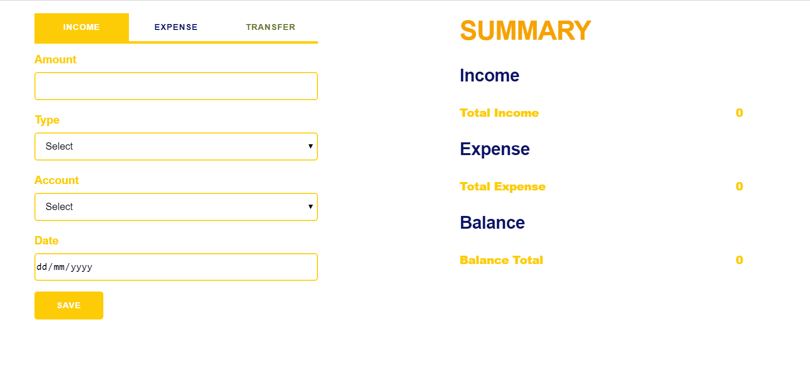

# Budget Planner

## Project Description

(project yet to be completed)

A JavaScript project that create a budget planner so that the users can record their daily spending and income. Users will be able to create their money accounts (debit, credit, investment and virtual money accounts). They will also be able to view their accounts balance.

External API will be used in terms of displaying investment values in stock, real estate property etc. currency API will alos be implemented to display exchange rate and currency converter results.

## Project Link

Project to be completed, no deployment at the moment.

## Main features

- record expense & income

- view asset account balance(TBC)
- view expense chart(TBC)
- create account and sub-account(TBC)
- generate Balance Sheet(TBC)
- view investment portfolio(TBC)
- real time? stock market chart(TBC)
